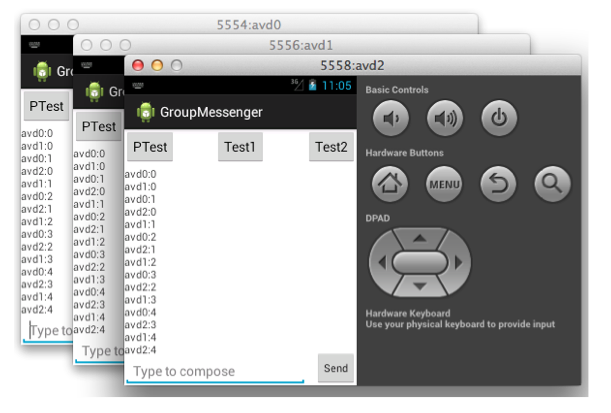

# Android Programming in Distributed System, Dec 2012-May 2013
***

## Simple Messenger

**Project discription:**
> This is a simple messenger.

> Two phones can send messages to each other after installing this app

## Totally and Causally Ordered Group Messenger

**Project discription:**
> Design a group messenger that preserves total ordering as well as causal ordering of all messages. In addition, implemented a key-value table that each device uses to individually store all messages on its local storage.

## DHT system

**Project discription:**

> Design a simple distributed key-value storage based on Chord. Mainly implemented:

1. ID space partitioning/re-partitioning 
2. Ring-based routing
3. Node joins.

The content provider in this app implemented all DHT functionalities and support insert and query operations. Thus, if you run multiple instances of your app, all content provider instances form a Chord ring and serve insert/query requests in a distributed fashion according to the Chord protocol.

## Simple Dynamo

**Project discription**

>This project implements a simplified version of Dynamo. Manily implemented:

1. Partitioning
2. Replication
3. Failure handling

